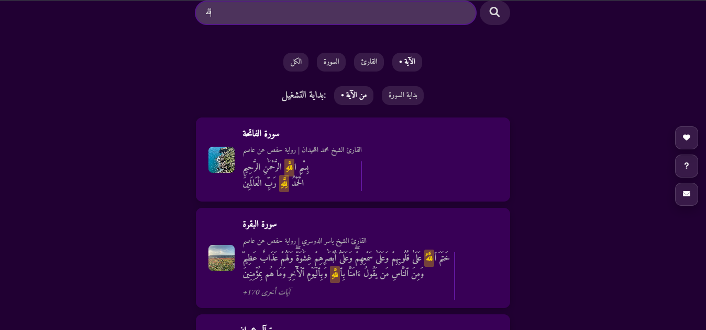
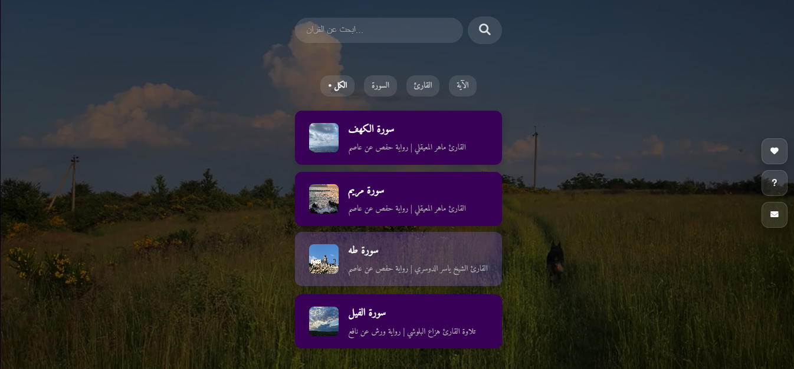
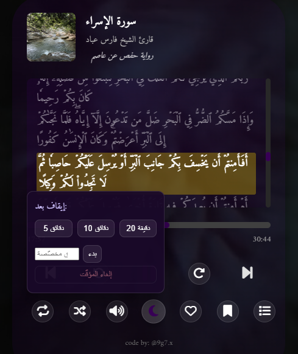
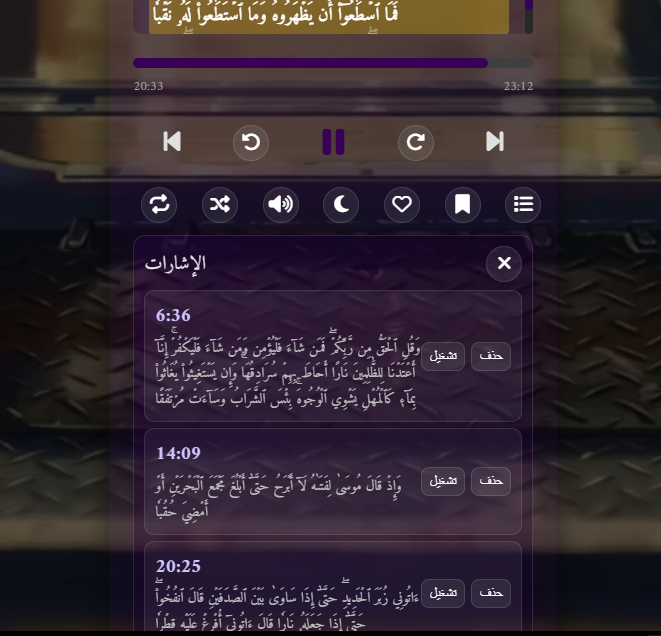

  

    
    <h1 style="color: #fff; margin: 1rem 0; font-size: 2.5rem; text-shadow: 2px 2px 4px rgba(0,0,0,0.3);">🌙 المصحف الشريف | Holy 

  
  

    <h3 style="text-align: center; margin-bottom: 1.5rem; color: #2c3e50; font-size: 1.5rem;">تواصل معنا | Contact Us</h3>
    

      <a href="https://t.me/pnqqy" target="_blank" style="text-decoration: none; transition: transform 0.3s ease;">
        

          
          تيليجرام
        

      </a>
      <a href="https://www.instagram.com/9g7.x" target="_blank" style="text-decoration: none; transition: transform 0.3s ease;">
        

          
          انستقرام
        

      </a>
      <a href="https://www.facebook.com/yourfacebook" target="_blank" style="text-decoration: none; transition: transform 0.3s ease;">
        

          
          فيسبوك
        

      </a>
      <a href="https://www.tiktok.com/@9g.7x" target="_blank" style="text-decoration: none; transition: transform 0.3s ease;">
        

          
          تيك توك
        

      </a>
      <a href="https://www.youtube.com/@vqer" target="_blank" style="text-decoration: none; transition: transform 0.3s ease;">
        

          
          يوتيوب
        

      </a>
    

  

---

# 📋 جدول المحتويات
- [🏁 المقدمة](#-المقدمة)
- [✨ المميزات](#-المميزات)
- [⚙️ المتطلبات](#️-المتطلبات)
- [🚀 البدء السريع](#-البدء-السريع)
- [📚 التوثيق](#-التوثيق)
- [🤝 المساهمة](#-المساهمة)
- [📄 الترخيص](#-الترخيص)
- [📞 التواصل](#-التواصل)

## 🏁 المقدمة

  

    مشروع <strong>المصحف الشريف</strong> هو منصة متكاملة تهدف إلى تيسير الوصول إلى كتاب الله عز وجل. نقدم خدمة شاملة للقرآن الكريم تشمل التلاوة بالصوت، التفسير، البحث المتقدم، وتفاسير كبار المفسرين. تم تطويره بأحدث التقنيات لضمان تجربة مستخدم سلسة وسهلة.
  

## ✨ المميزات

  

    <h4 style="color: #2c3e50; margin-top: 0; display: flex; align-items: center; gap: 0.5rem;">
      1
      📖 مصحف كامل
    </h4>
    
عرض المصحف الشريف كاملاً بتصميم جميل وسهل القراءة مع دعم للخطوط القرآنية.

  

  

    <h4 style="color: #2c3e50; margin-top: 0; display: flex; align-items: center; gap: 0.5rem;">
      2
      🎧 تلاوات صوتية
    </h4>
    
استمع لأشهر القراء بتلاوات عالية الجودة مع إمكانية التحميل والاستماع دون اتصال.

  

  

    <h4 style="color: #2c3e50; margin-top: 0; display: flex; align-items: center; gap: 0.5rem;">
      3
      🔍 بحث متقدم
    </h4>
    
ابحث في القرآن الكريم بالكلمات أو الآيات مع نتائج فورية.

  

  

    <h4 style="color: #2c3e50; margin-top: 0; display: flex; align-items: center; gap: 0.5rem;">
      4
      📱 واجهة متجاوبة
    </h4>
    
تصميم عصري يعمل على جميع الأجهزة بسلاسة.

  

  

    <h4 style="color: #2c3e50; margin-top: 0; display: flex; align-items: center; gap: 0.5rem;">
      5
      🌙 وضع ليلي
    </h4>
    
وضع مظلم مريح للعيون للقراءة الليلية.

  

## 🖥️ واجهة تصفح السور

  
  

    واجهة سهلة الاستخدام لتصفح سور القرآن الكريم مع إمكانية الاختيار السريع والتنقل السلس بين السور
  

## 🔍 بحث متقدم في القرآن الكريم

  
  

    ميزة البحث المتقدم تتيح لك العثور على أي آية أو كلمة في القرآن الكريم بسهولة وسرعة
  

## ❤️ السور المفضلة

  
  

    احفظ سورك المفضلة بضغطة زر للوصول السريع إليها لاحقاً. يمكنك إضافة أي سورة إلى المفضلة بالنقر على زر القلب
  

## ⏱️ مؤقت النوم التلقائي

  
  

    استمتع بتجربة استماع مريحة مع مؤقت النوم التلقائي. اضبط المؤقت ليغلق التطبيق تلقائياً بعد انتهاء المدة المحددة
  

## 💾 حفظ الآيات المفضلة

  
  

    يمكنك بسهولة حفظ أي آية مفضلة لديك عن طريق النقر على زر الحفظ (💾) بجانب الآية. لعرض جميع الآيات المحفوظة، اضغط على زر القائمة ثم اختر "الآيات المفضلة"
  

## ⚙️ المتطلبات
- متصفح ويب حديث (يفضل Chrome أو Firefox)
- اتصال بالإنترنت للوصول إلى الخدمات السحابية

## 🚀 كيفية الاستخدام

### تصفح المصحف
1. قم بزيارة الموقع الرسمي: [https://example.com/quran](https://example.com/quran)
2. اختر السورة من القائمة
3. ابدأ القراءة والاستماع

### المميزات المتاحة
- تصفح السور والآيات
- الاستماع للتلاوات
- البحث في النص القرآني
- حفظ التقدم في القراءة

## 📞 التواصل
- تيليجرام: [@pnqqy](https://t.me/pnqqy)
- انستقرام: [@9g7.x](https://instagram.com/9g7.x)
- البريد الإلكتروني: [info@quranapp.com](mailto:info@quranapp.com)
- تيك توك: [@9g.7x](https://tiktok.com/@9g.7x)
- يوتيوب: [@vqer](https://youtube.com/@vqer)

---

# 📋 Table of Contents
- [🏁 Introduction](#-introduction)
- [✨ Features](#-features)
- [⚙️ Requirements](#️-requirements)
- [🚀 Quick Start](#-quick-start)
- [📚 Documentation](#-documentation)
- [🤝 Contributing](#-contributing)
- [📄 License](#-license)
- [📞 Contact](#-contact)

## 🏁 Introduction
A comprehensive Holy Quran project designed to provide easy access to the Holy Quran with multiple features. The project includes the complete Quran with Tafseer and other services.

## ✨ Features
- 📖 Complete Holy Quran text
- 🎧 Audio recitations by famous reciters
- 🔍 Advanced search in the Quranic text
- 📱 User-friendly interface
- 🌙 Night mode for comfortable reading

## 🖥️ Surah Browsing Interface

  
  

    User-friendly interface for browsing Quranic Surahs with quick selection and smooth navigation between chapters
  

## 🔍 Advanced Quran Search

  
  

    Advanced search feature allows you to quickly find any verse or word in the Holy Quran with ease
  

## ❤️ Favorite Surahs

  
  

    Save your favorite surahs with one click for quick access later. Simply tap the heart icon to add any surah to your favorites
  

## ⏱️ Sleep Timer

  
  

    Enjoy a comfortable listening experience with our sleep timer. Set the timer to automatically stop playback after your desired duration
  

## 💾 Save Favorite Verses

  
  

    Easily save your favorite verses by clicking the save (💾) button next to any verse. To view all your saved verses, click the menu button and select "Favorite Verses"
  

## ⚙️ Requirements
- Modern web browser (Chrome or Firefox recommended)
- Internet connection for cloud services

## 🚀 How to Use

### Browse the Quran
1. Visit the official website: [https://example.com/quran](https://example.com/quran)
2. Select a Surah from the list
3. Start reading and listening

### Available Features
- Browse Surahs and Ayahs
- Listen to recitations
- Search in the Quranic text
- Save reading progress

## 📚 Available Resources
- [Android App](https://play.google.com/store/apps/details?id=com.example.quran)
- [iOS App](https://apps.apple.com/app/id1234567890)
- [Official Website](https://example.com)
- [Telegram Channel](https://t.me/yourtelegram)

## 🤝 Contributing
We welcome contributions to the project. You can:
- Report bugs
- Suggest improvements
- Contribute to translations
- Develop new features

## 📄 License
This project is licensed under the [MIT License](LICENSE).

## 📞 Contact
- Email: [info@quranapp.com](mailto:info@quranapp.com)
- Telegram: [@pnqqy](https://t.me/pnqqy)
- Instagram: [@9g7.x](https://instagram.com/9g7.x)
- TikTok: [@9g.7x](https://tiktok.com/@9g.7x)
- YouTube: [@vqer](https://youtube.com/@vqer)

---
  <h3 style="margin: 0 0 1rem 0; font-size: 1.5rem; display: flex; align-items: center; justify-content: center; gap: 0.8rem;">
    Developed with ❤️ for the sake of Allah | تم التطوير بكل حب في سبيل الله
  </h3>
  

    

      <i class="fas fa-quran" style="margin-left: 0.5rem;"></i>
      © 2025 المصحف الشريف - جميع الحقوق محفوظة
    

    

      <i class="fas fa-copyright" style="margin-left: 0.5rem;"></i>
      © 2025 Holy Quran - All Rights Reserved
    

  

  

    

      <i class="fas fa-info-circle" style="margin-left: 0.5rem;"></i>
      هذا المشروع غير ربحي، نهدف من خلاله إلى خدمة كتاب الله تعالى
    

  

